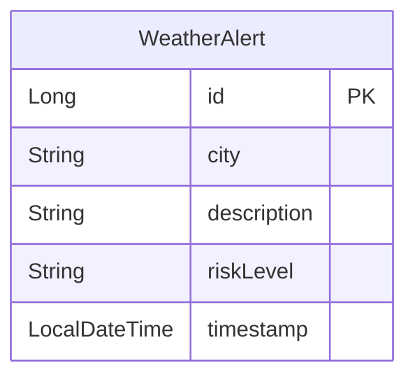
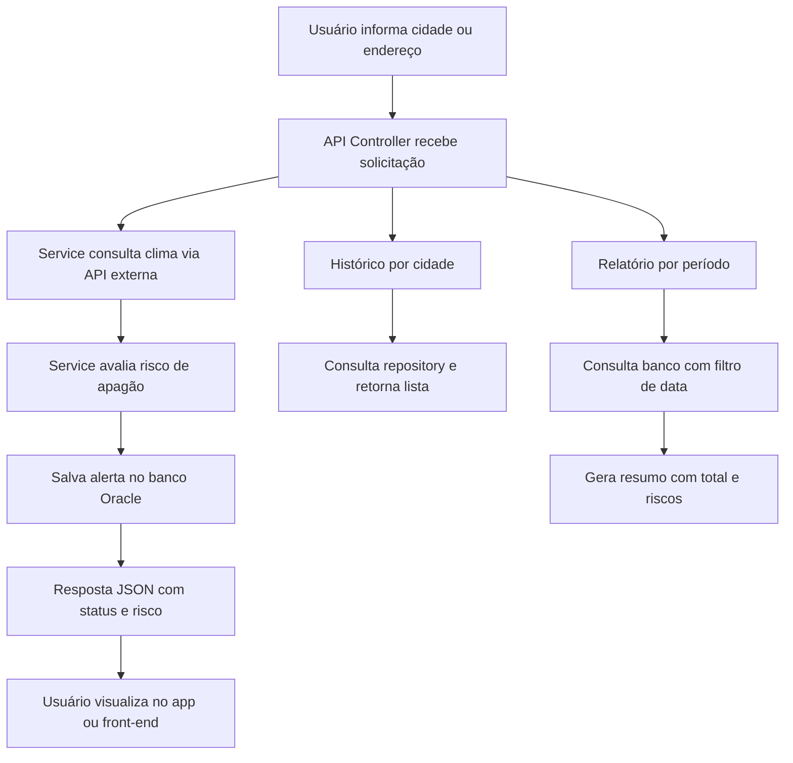

# Arkstorm - Monitoramento de Apagões por Clima

O Arkstorm é um sistema completo para monitorar condições climáticas adversas e prever riscos de apagão. Ele coleta dados de APIs públicas e permite consultas por cidade, endereço e histórico.

- Julia Marques (RM98680)
- Guilherme Morais (RM551981)
- Matheus Gusmão (RM550826)

## 📦 Funcionalidades

- Previsão do tempo por cidade
- Avaliação de risco de apagão
- Registro de alertas em banco de dados Oracle
- Consulta de histórico de alertas
- Consulta por endereço (com geocodificação)
- Relatório dos últimos X dias
- API documentada com Swagger

## 🚀 Tecnologias Utilizadas

- Java 17+
- Spring Boot
- Spring Data JPA
- Banco de Dados Oracle
- API OpenWeatherMap
- API Nominatim (OpenStreetMap)
- Swagger via Springdoc OpenAPI

## 🛠️ Dependências principais

- spring-boot-starter-web
- spring-boot-starter-data-jpa
- ojdbc11 (Oracle)
- org.json
- springdoc-openapi-ui

## ⚙️ Execução

1. Configure o Oracle e crie um schema com permissão de criação de tabelas.
2. Ajuste o arquivo application.properties com as credenciais.
3. Execute o projeto com:

```bash
./mvnw spring-boot:run
```
4. Acesse o Swagger UI:
[text](http://localhost:8080/swagger-ui.html)

## 📌 Observações

- O sistema cria as tabelas automaticamente se não existirem (ddl-auto=update).
- O endpoint por endereço depende de acesso à internet para a API de geocodificação.

## 🗂️ Diagrama de Entidade-Relacionamento (ER)



## 🔁 Diagrama de Workflow (Fluxo de Uso)



## ✅ Guia de Uso da API Arkstorm

Este guia mostra como usar cada funcionalidade da API utilizando o Swagger UI ou ferramentas como Postman.

---

### 🔍 1. Consultar risco por cidade

- Método: GET  
- Endpoint: `/api/weather/{city}` 
- Resposta esperada:
```json
{
  "city": "São Paulo",
  "status": "Sem risco identificado"
}
```

### 📫 2. Consultar risco por endereço (geocodificação)

- Método: POST
- Endpoint: `/api/weather/local`
- Body (JSON):
```json
{
  "address": "Avenida Paulista, São Paulo"
}
```
- Resposta esperada:
```json
{
  "city": "Avenida Paulista, Bela Vista, São Paulo, ...",
  "status": "Risco alto de apagão"
}
```
### 🕒 3. Histórico de alertas por cidade

- Método: GET
- Endpoint: `/api/weather/history/{city}`
- Resposta esperada:
```json
[
  {
    "id": 1,
    "city": "Curitiba",
    "description": "chuva forte",
    "riskLevel": "Risco alto de apagão",
    "timestamp": "2025-05-28T18:30:00"
  }
]
```
### 📊 4. Relatório de risco dos últimos dias

- Método: GET
- Endpoint: `/api/weather/report/{city}?days=7`
- Resposta esperada:
```json
{
  "city": "Curitiba",
  "totalAlerts": 2,
  "risks": [
    "Sem risco identificado",
    "Risco alto de apagão"
  ]
}
```
